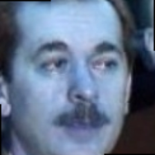
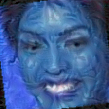

# Repo for Computer Security course project

## paper outline + jack's notes

### abstract

### introduction

#### motivation

Jake

#### literature review

Jack

how FR works

review of SotA for attacks (poisoning and evasion)


### Our Attack

Jack

#### adversarial ml overview

This project is based on two basic ideas:

1. For any learning algorithm, an adversarial input is that which (in this project) creates a difference in the true label and the model's output. 

So, for facial recognition systems, the an adversarial input is any such that a human can still recognize the face as being the same person, but a facial recognition algorithm produces a different output. Because requiring a human to validate the true label for any possible attack image is costly, a proxy is instead used. Consider an image of a face as a point in a highly-dimensional space (so if an image is 224x224 rgb pixels, the images is simply a point in 224x224x3 space). Then, any point close to this point likely has the same true label, where "close" can be defined by the $l_1, l_2$ or $l_\infty$ norm. 

Given an input $x$ and it's true label $y$, the goal is then to find some adverserial input $x'$ such that (1) the classification of $x'$ is wrong ($f(x') \ne y$) and (2) the distance between $x$ and $x'$ is small ($\|x - x'\| < \epsilon$).

2. Facial recognition systems are based on deep neural networks. Deep neural networks work because they are differentiable, that is, for any input $x$, the output of the recognition algorithm $f(x)$ can be calculated 


#### specifics of our attack

Jack

### Experimental Setup

Matt

surrogate   VGG-Face # classifier, trained on our data

test_model  VGG-Face # encoders, deepface. no training on our data
val_model   FaceNet

x, y test data
for all hyper-parameters / attack types
x' = attack(surrrogate, x)
y' = test_model(x')

choose best attack based on y'

eval on val
y' = val_model(x')

### results

Accuracy of a seperate model (Test: VGG, Val: FaceNet) on the attack images. Lower indicates a better attack.

All attacks were run over a hyper-parameter grid with a cross-validation fold of 10 images, then the best performing hyperparameter set was used to compute performance using the entire validation set.

In all cases, a VGG-based model was used as the proxy model.

Two targeted vector attacks hyper-parameter sets were chosen to demonstrate the trade-off between image quality and performance

Attack | VGG Performance  | FaceNet Performance | Sample Image
-------|------------------|---------------------|-------------
No-box              | 13% | 24% | 
Untargeted Vector   | 21% | 62% | 
Targeted Vector 1   | 0%  | 0%  | 
Targeted Vector 2   | 23% | 31% | 
Untargeted Classifier | 9% | 21% | 

### Use Case / comparison with other algorithms

Jake

### Future Work

Jack (talk about the yny classifier / easier training / possibilities with better vectors / lower training cost with the no-box attack)

### conclusions


### attack types

pgd as inner attack for everything
fgsm attack overrfit
carlini-wagner overrfit, didn't run always

differs: surrogate model / label

* = sota ,
' = ours
label = [class_label', vector*]
targeted = [True*, False']


### Expected Use Case

Jake 

how / why a user would prevent FR

* in general (motivation, own sub-section of introduction)
* why prefer our method over others (in particular, others w/ higher accuracy or other desirable qualities)
    - "no-box" attack (sota), high acc, but poor image quality
    - vector-based attack (applying Fawkes to evasion) - same problems, blue images & low acc or terrible quality and high acc
* downsides
    - need to train it to recognize you (12 hours used in our example)


why we need to train the model:
    y' = model(x)

    y in {0,1,2..}
    lfw num classes = 5479

    VGG outputs a 8631 dim vector
    classifier layer reduces this 8631 -> num classes (5479) 
    [0,0,0,...,1,0,0,...,0]

    VGG + classifier layer => y'

VGG ~=~ hashing_function

VGG(face_image_1_person_1) ~=~ hash_1
VGG(face_image_2_person_1) ~=~ hash_2
then, distance(hash_1, hash_2) < epsilon

VGG(face_image_1_person_2) ~=~ hash_3
then, distance(hash_1, hash_3) > epsilon

adversarial exmples x':
    model(x') != y
if model is bad, then
    model(x) != y
at that point, x' = x, and we're done

basically:
x = derivative(model(x)) + x

our model only trained on up to 10 images of each person (for many, just 1 or 2)

1st image -> train
2nd image -> test
3rd image -> val

rest determined to create a (60%, 20%, 20%) split
 
## Installation

Required libraries:

- deepface 
- numpy
- tensorflow
- torch
- torchvision
- sklearn

Install all with one line:
`pip install numpy tensorflow torch torchvision deepface sklearn`

Required datasets:

- Labeled Faces in the Wild (LFW)

This is downloaded by torch into the data directory of this project upon running - see test_data_loader.ipynb

If you want to use the VGG-Face attack, you need to download the pre-trained weights from [here](http://www.robots.ox.ac.uk/~albanie/models/pytorch-mcn/vgg_face_dag.pth)

Download the above and save it into the attacks/no_box folder

Note if you want to use CUDA on Windows, you'll need [Visual Studio 2019](https://docs.microsoft.com/en-us/visualstudio/releases/2019/release-notes), cudatoolkit, and cuDNN (Nvidia developer account required). yeah, it's annoying. 

## Develoment

0. Clone the repository: `git clone https://github.com/will-jac/adverse-face`
1. Create a branch: `git branch image-distance`
2. Check out the branch: `git checkout image-distance`
3. Make changes, then add and commit them: `git add file; git commit -m "useful message"`
4. When you're ready, push to github: `git push`
5. When you're done making changes, merge them into main:
```{bash}
git checkout main
git merge main
```
This may require manual review. Always check that it is working before pushing, and always push everything to remote before merging.

Notes:

`main.py`

- Right now, the main.py file is just training & attacking with the no-box attack. This can be changed.
- Likely what will be best is to have a python file in the base dir of the project for generating each attack, and one for evaling each attack.
- TODO: Do this after eval.py is created? Or control the two with params passed into main.py?

`data/datasets/load_data.py`
- loads the data. `batch_size` is the number of images. 
- `batch_by_people` is a flag for no-box attacks - if True, each batch will contain `batch_size/2` images of one person, and `batch_size/2` of another person
- `shuffle` will shuffle the dataset. If False, each batch will be deterministic


## Attacks

### No-Box

Idea: train a surrogate auto-encoder model on unsupervised image reconstruction. Then, attack the surrogate model. Any attack that works well on the surrogate will probably work well on an actual FR system.

Code: see attacks/no_box/no_box.py

Surrogate model: Currently using Auto-Encoder based on ResNet.
Can also use VGG and pre-trained variants of both. Currently not working - will need to build special AE for this.
Saved under attacks/no_box

Attack Images: Saved under attacks/no_box

TODO:

[] create VGG and ResNet pre-trained auto-encoders
[] get the prototypical attack working

### Obfuscated Gradients

TODO (Jack)

## Evaluated FR systems

TODO

## Plans

[x] Get datasets (using [LFW](http://vis-www.cs.umass.edu/lfw/))
[] Create and train working FR model 
[-] Create working attack
[x] Working no-box attack with ResNet surrogate model
[] Code a VGG surrogate model 
[] Obfuscated Gradient attacks
[] ???
[] Profit
